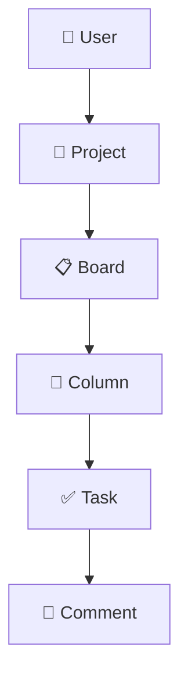

# Task Master - Project Management System

A robust, scalable backend built with **NestJS**, **TypeORM**, and **PostgreSQL** for managing projects, boards, tasks, and team collaboration.

## ✨ Features & Functionality

The platform offers a comprehensive set of features to handle every aspect of project agile management and task tracking:

### 🔐 Authentication & Authorization
- **User Registration & Login**: Secure authentication using JWT.
- **Role-Based Access Control (RBAC)**: Support for `OWNER`, `ADMIN`, `MEMBER` and `VIEWER` roles within projects.
- **Protected Routes**: Strict project-level permission checks for all sensitive operations.

### 📂 Project Management
- **CRUD Operations**: Create, Read, Update, and Delete projects.
- **Member Management**: Add team members, manage their roles, and remove them dynamically.
- **Project Ownership**: Clear distinction between project owners and members to prevent unauthorized destructive actions.

### 📋 Boards & Workflows
- **Board Operations**: Create, List, View, Update, and Delete boards within a project.
- **Pagination & Caching**: Optimized endpoints with Redis-based caching and request pagination.

### 📑 Column Management
- **Stage Tracking**: Add columns to represent workflow stages (e.g., To Do, In Progress, Done).
- **Column Operations**: Create, list, edit, and delete columns.
- **Reordering**: Dedicated API functionality to reorder columns seamlessly across the board.

### ✅ Task Tracking
- **Task Lifecycle**: Create tasks within specific columns and retrieve their details.
- **Assignments**: Assign and unassign users to specific tasks.
- **State Management**: Move tasks between columns (to support frontend drag-and-drop mechanics).
- **Task Updates**: Edit task details, metadata, and eventually delete them.

### 💬 Collaboration (Comments)
- **Discussion Threads**: Add comments to individual tasks to track conversations and progress.
- **Comment Retrieval**: Fetch all comments associated with a specific task.
- **Management**: Delete comments if authorized.

### 🛠 System & Infrastructure
- **Caching Layer**: High-performance caching mechanism via `@nestjs/cache-manager` integrated with Redis.
- **Docker Ready**: Includes `Dockerfile` and setup for containerized deployment.
- **Data Seeding & Migrations**: Built-in scripts to generate consistent database structures via TypeORM.
- **API Documentation**: Auto-generated Swagger (OpenAPI) and Postman collections.

---

## 🏗 System Hierarchy

The application follows a strict hierarchical structure to maintain data integrity and clear ownership:



1.  **User**: The system accounts.
2.  **Project**: High-level containers for work (Owned by a User).
3.  **Board**: Specific views or workflows within a project (e.g., Development, Marketing).
4.  **Column**: Stages within a board (e.g., To Do, In Progress, Done).
5.  **Task**: Individual work items.
6.  **Comment**: Discussion and updates related to a specific task.

---

## 🚦 API Endpoints Overview

Here is a quick glance at the available API routes (all prefixed with `/api/v1` or `/api` based on configuration):

- **Authentication**: `POST /auth/register`, `POST /auth/login`
- **Projects**: `GET`, `POST`, `PATCH`, `DELETE` operations on `/projects`
- **Project Members**: `GET`, `POST`, `DELETE` operations on `/projects/:id/members`
- **Boards**: `GET`, `POST` on `/projects/:projectId/boards`; `GET`, `PATCH`, `DELETE` on `/boards/:boardId`
- **Columns**: `GET`, `POST` on `/boards/:boardId/columns`; `PATCH`, `DELETE` on `/columns/:columnId`; `PATCH /boards/:boardId/columns/reorder`
- **Tasks**: `GET`, `POST` on `/columns/:columnId/tasks`; `GET`, `PATCH`, `DELETE` on `/tasks/:taskId`; `PATCH /tasks/:taskId/assign`, `PATCH /tasks/:taskId/move`
- **Comments**: `GET`, `POST` on `/tasks/:taskId/comments`; `DELETE` on `/comments/:commentId`

For detailed requests, see formatting in [Swagger UI](#api-documentation) or the included `PROJECT_POSTMAN_COLLECTION.md`.

---

## 🚀 Technical Approach

### 1. Layered Architecture
We follow a clean, layered architecture to separate concerns:
-   **Controllers**: Handle incoming HTTP requests and map them to service calls.
-   **Services**: Contain the core business logic, including complex permission checks.
-   **Repositories**: Abstract database operations using the Repository Pattern (via Interfaces) to ensure loose coupling.
-   **Entities**: Define the database schema using TypeORM decorators.

### 2. Security & Authorization
-   **JWT Authentication**: Secure API access using JSON Web Tokens.
-   **Project-Level Access**: Every sensitive operation (Creating tasks, deleting comments, moving columns) verifies project membership before execution.
-   **Role-Based Control**: Support for `OWNER`, `ADMIN`, `MEMBER`, and `VIEWER` roles within projects to restrict destructive actions.

### 3. Data Integrity & Validation
-   **DTOs (Data Transfer Objects)**: Strict request validation using `class-validator`.
-   **Mappers**: Clean separation between internal database entities and public API responses, ensuring sensitive fields (like passwords) are never exposed.
-   **Cascading Deletes**: Relationships are configured to clean up child resources (e.g., deleting a Board removes all its Columns and Tasks automatically).

---

## 🛠 Tech Stack

-   **Runtime**: Node.js (v18+)
-   **Framework**: [NestJS](https://nestjs.com/)
-   **Language**: TypeScript
-   **Database**: PostgreSQL
-   **ORM**: [TypeORM](https://typeorm.io/)
-   **Caching**: Redis
-   **Documentation**: Swagger (OpenAPI)

---

## 🏁 Getting Started

### Prerequisites
-   Node.js (v18+)
-   PostgreSQL instance
-   Redis instance (Required for caching features)
-   Docker (Optional, for containerization)

### Installation
1.  Clone the repository.
2.  Install dependencies:
    ```bash
    npm install
    ```
3.  Configure your `.env` file with database and redis credentials.

### Running the App
```bash
# Development mode
npm run start:dev

# Production build
npm run build
npm run start:prod
```

### Docker
You can also run the application using Docker:
```bash
docker build -t task-master .
docker run -p 3000:3000 --env-file .env task-master
```

### API Documentation
Once running, you can access the Swagger UI at:
`http://localhost:3000/api` (or your configured port).
Alternatively, import `PROJECT_POSTMAN_COLLECTION.md` into Postman to test requests locally.
